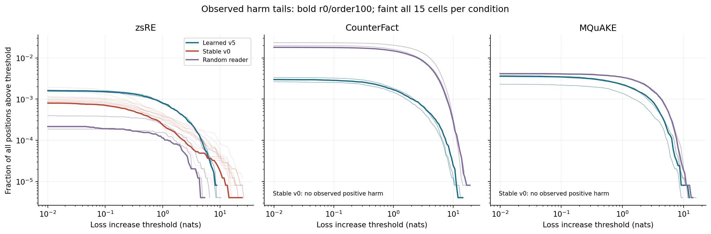
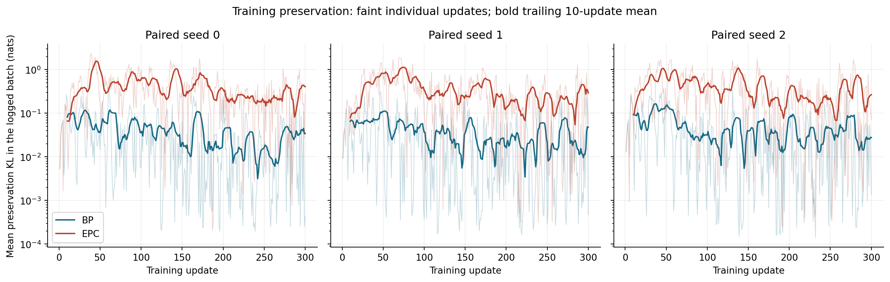

# Entropy, KL divergence, and the extremes in our experiments

Prepared for charlie by Capex · 9 October 2026 · analysis of saved results, no model execution.

**The tails depend on both the editing dataset and the kind of cap.** For the main learned cap, CounterFact and MQuAKE produce more frequent and more severe ordinary-text harm than zsRE. The clearest evidence for a heavier-than-exponential tail on the measured range remains **stable v0 on zsRE**. A larger maximum, a larger KL, or a larger Shannon entropy is not by itself evidence of a heavier tail.

I measured **330 completed evaluation configurations, seven 300-update training histories, and nine cached teacher-logit populations**. The new MQuAKE analysis matters: its learned-cap harm is substantial, but its generalized-Pareto fit does not predict held-out extremes better than an exponential. The analysis also finds much larger logged preservation KL during ePC reader training than BP training, without a uniform corresponding change in evaluation harm. **The learned cap's KL tails on zsRE and CounterFact also show a heavier-than-exponential pattern at the lower thresholds, even though its actual-token harm tails are close to exponential.** Those are different random variables.

The main limitation is explicit: **we did not save per-example training losses or cap-on vocabulary distributions for the full evaluation.** We can measure training-update averages and evaluation-position tails, and can recover the frozen teacher's predictive entropy from caches. We cannot reconstruct the missing within-batch extremes or cap-on predictive entropy from a scalar loss or KL.

## 1. What is being measured?

For a particular text prefix, GPT-2 assigns a probability to each of its 50,257 possible next tokens. Let p be that distribution without the cap, q the distribution with it, and y the actual next token.

- **Loss / surprisal:** L = −ln q(y). A larger loss means the actual continuation received less probability. For a single known target, this is cross-entropy against a one-hot target; it is not Shannon entropy of q.
- **Harm:** Δ = L(cap) − L(cap-off) = ln[p(y)/q(y)]. Positive values are worse; negative values are improvements. A five-nat increase means the actual token became about 148 times less likely; ten nats means about 22,026 times.
- **Token-prediction KL:** D(p‖q) = Σ p(v) ln[p(v)/q(v)]. It measures how the whole next-token distribution changed, weighting tokens by the no-cap distribution. It is nonnegative apart from numerical roundoff. It is not the reverse divergence D(q‖p), and it is not the loss on just the actual token.
- **Predictive Shannon entropy:** H(p) = −Σ p(v) ln p(v). It measures uncertainty across next-token choices. A distribution concentrated on one token has entropy near zero; a uniform distribution over the vocabulary has entropy ln(50,257) ≈ 10.8249 nats. High confidence can be correct or wrong.

We also compute two explicitly different Shannon entropies below: entropy of **loss bins**, and entropy of **where the total positive loss is concentrated**. These answer questions about the losses, not the model's uncertainty over vocabulary tokens. All logarithms are natural and all entropy/KL values are nats.

## 2. Evaluation: the dataset comparison

These are **ordinary-text validation positions after editing with each named dataset**, not losses on that dataset's questions. Each cell scores the same 245,237 positions in 1,931 reset-context windows. Thus the dataset label identifies which facts were installed in the cap. It does not mean CounterFact and MQuAKE supplied the ordinary text being scored.

There are fifteen main cells per condition/dataset: three subject realizations, each run in five orders. zsRE and CounterFact finish at 1,000 edits; MQuAKE at 300. These are useful observed-system comparisons, but the unequal edit counts prevent a clean causal claim that dataset identity alone caused the difference. Reused text positions and five orders are not independent replications.

### Main learned cap: averages hide the extremes

| Editing dataset | Mean KL | Mean ΔNLL | Positions with Δ > .01 | Mean Δ given Δ > .01 | Mean cell ES99+ | Largest Δ, any cell |
| --- | --- | --- | --- | --- | --- | --- |
| zsRE | 0.0023864 | 0.0024859 | 0.15944% | 1.6295 | 0.25982 | 11.048 |
| CounterFact | 0.0054246 | 0.0054979 | 0.29835% | 1.9125 | 0.57061 | 15.382 |
| MQuAKE | 0.0060508 | 0.0060737 | 0.3133% | 1.9804 | 0.62047 | 17.061 |

**ES99+** is the average positive harm in the worst 1% of all positions, with zero and beneficial positions represented by zero. This differs from the conditional mean among harmed positions. Means in this table are equal-cell means; conditional severity weights by event counts; maxima take the largest observed position across cells. Full per-cell quantiles, including 99.9% and 99.99%, are saved.

The learned cap's worst MQuAKE increase, 17.0605 nats, corresponds to about **25.7 million times less probability for that observed token**. That is a probability ratio at a fixed prefix, not 25.7 million wrong answers or a measured probability of real-world catastrophe.

### All three main caps: frequency, severity and KL

| Dataset | Cap | Harm frequency > .01 | ES99+ | Worst harm | Mean KL | Worst KL |
| --- | --- | --- | --- | --- | --- | --- |
| zsRE | Learned v5 | 0.15944% | 0.25982 | 11.048 | 0.0023864 | 9.3216 |
| zsRE | Stable v0 | 0.10409% | 0.17865 | 27.684 | 0.0016475 | 26.269 |
| zsRE | Random reader | 0.026641% | 0.048119 | 7.001 | 0.00048127 | 7.073 |
| CounterFact | Learned v5 | 0.29835% | 0.57061 | 15.382 | 0.0054246 | 13.261 |
| CounterFact | Stable v0 | 0% | 0 | 0 | 0 | 0 |
| CounterFact | Random reader | 2.045% | 5.4537 | 20.283 | 0.071115 | 18.9 |
| MQuAKE | Learned v5 | 0.3133% | 0.62047 | 17.061 | 0.0060508 | 15.335 |
| MQuAKE | Stable v0 | 0% | 0 | 0 | 0 | 0 |
| MQuAKE | Random reader | 0.40886% | 1.2245 | 15.072 | 0.012172 | 15.462 |

Stable v0's zero ordinary-text change on CounterFact and MQuAKE is an observed lack of intervention on this text population. Its paraphrase generalization is also zero there; zero harm does not establish a useful safe editor. The random reader's CounterFact result shows particularly frequent collateral change.



Each curve shows the fraction of all positions with loss increase above the horizontal-axis threshold. Faint curves show all fifteen cells; bold curves are the outcome-independent illustrative choice realization 0/order 100. Zero survival is omitted from the logarithmic plot. Smooth connecting lines join a fixed threshold grid; their apparent straightness is not a power-law test.

## 3. How heavy are the tails, as opposed to how large is the harm?

The empirical frequency and severity above are direct measurements. To describe shape, we compare an exponential distribution with a generalized Pareto distribution (GPD) for positive excesses Δ−u. The GPD shape ξ is zero for an exponential, positive for a power-law tail, and negative for a finite endpoint *within that fitted model*. Fitting a positive ξ does not prove an asymptotic power law; fitting a negative ξ does not establish a real safety bound.

The following table uses u = .01 nat, at least 100 exceedances in at least 30 windows, and five-fold held-out-window predictive likelihood. A positive score difference favors GPD; a negative difference favors the simpler exponential. A fitted endpoint that excludes a held-out observation causes a support failure, which remains visible rather than being dropped from a score.

| Dataset | Cap | Fitted ξ range | GPD − exponential nats/excess | Valid comparisons | Cells with support failure |
| --- | --- | --- | --- | --- | --- |
| zsRE | Learned v5 | 0.0435 to 0.0588 | -0.00039 to +0.00026 | 15/15 | 0 |
| zsRE | Stable v0 | 0.4335 to 1.0286 | +0.14859 to +0.59354 | 15/15 | 0 |
| zsRE | Random reader | not identified | unavailable | 0/15 | 0 |
| CounterFact | Learned v5 | 0.0294 to 0.0978 | -0.00104 to +0.00276 | 15/15 | 0 |
| CounterFact | Stable v0 | not identified | unavailable | 0/15 | 0 |
| CounterFact | Random reader | -0.2622 to -0.1841 | +0.03254 to +0.03254 | 5/15 | 10 |
| MQuAKE | Learned v5 | -0.1123 to -0.0480 | -0.01505 to -0.00033 | 15/15 | 0 |
| MQuAKE | Stable v0 | not identified | unavailable | 0/15 | 0 |
| MQuAKE | Random reader | -0.2864 to -0.2195 | unavailable | 0/15 | 15 |

**Interpretation:**

- **Stable v0, zsRE:** consistently positive shapes and better held-out GPD predictions support a heavier tail over the measured range. The illustrative shape's existing 95% window-bootstrap interval is about 0.390–0.779. This is our strongest such finding, not a measurement of infinite variance.
- **Learned cap, zsRE and CounterFact:** small shape estimates and little predictive advantage for GPD support an economical exponential approximation over the observed range. Existing illustrative shape intervals include zero. This is not an equivalence test or a proof of an exponential asymptotic tail.
- **Learned cap, MQuAKE:** all fifteen primary-threshold shapes are negative. The illustrative interval is approximately −0.235 to −0.044, but all fifteen held-out predictive comparisons favor the exponential. Therefore the negative fit is not a validated hard ceiling. At thresholds .5 and 1, fourteen of fifteen GPD comparisons fail on held-out support; the remaining comparison favors the exponential.
- **Random reader, MQuAKE:** every primary-threshold fitted endpoint excludes held-out observations. The negative shape estimates cannot be used to promise bounded harm.
- **Zero/sparse cases:** a tail family is unidentifiable with no or too few observed events. That is an evidence limit, not a declaration of a light tail.

The examination of MQuAKE's 45 harm-tail distributions and all 135 primary-cell KL distributions below is **new exploratory post-freeze analyses of saved vectors**. The zsRE/CounterFact harm fits reuse the completed HT-17 record. This does not change the registered experiments, thresholds, selected readers or claims. All four thresholds (.01, .1, .5, 1) remain in the numerical output. Bootstrap intervals use 200 whole-window resamples, not independent tokens; they still omit uncertainty over new subjects/training seeds and possible dependence between windows.

### KL has its own tail

These are fits to per-position D(cap-off‖cap), not to the actual-token loss change. Two quantities can be related without having identical extreme events or fitted shapes.

| Dataset | Cap | KL-tail ξ range | GPD − exponential nats/excess | Valid comparisons | Cells with support failure |
| --- | --- | --- | --- | --- | --- |
| zsRE | Learned v5 | 0.2388 to 0.2737 | +0.01883 to +0.02267 | 15/15 | 0 |
| zsRE | Stable v0 | 0.8052 to 1.2959 | +0.46122 to +1.37283 | 15/15 | 0 |
| zsRE | Random reader | -0.1903 to -0.1903 | +0.00974 to +0.00974 | 5/15 | 0 |
| CounterFact | Learned v5 | 0.1750 to 0.3935 | +0.01033 to +0.03856 | 15/15 | 0 |
| CounterFact | Stable v0 | not identified | unavailable | 0/15 | 0 |
| CounterFact | Random reader | -0.2620 to -0.1846 | +0.02771 to +0.02771 | 5/15 | 10 |
| MQuAKE | Learned v5 | 0.0278 to 0.0649 | -0.00385 to -0.00115 | 15/15 | 0 |
| MQuAKE | Stable v0 | not identified | unavailable | 0/15 | 0 |
| MQuAKE | Random reader | -0.2064 to -0.1983 | +0.03093 to +0.03093 | 5/15 | 10 |

**A new distinction:** the learned cap's KL-tail shapes are positive on both zsRE and CounterFact, and GPD predicts held-out KL excesses better in all fifteen cells of each dataset at u=.01. For the illustrative cells, shape intervals are approximately **0.149–0.400 (zsRE)** and **0.251–0.547 (CounterFact)**. MQuAKE's illustrative interval, **−0.076–0.217**, includes zero, and all fifteen MQuAKE predictive comparisons favor the exponential.

This is evidence about the lower-threshold finite-range **KL** tail, not proof of an asymptotic class. Threshold sensitivity is material: the illustrative learned-cap KL shapes at u=.01/.1/.5/1 are **.274/.351/.119/−.157 for zsRE** and **.393/.481/.052/−.107 for CounterFact**. Thus a single positive shape at .01 should not be extrapolated indefinitely into the extremes. Read these alongside the worst-KL column: shape describes the decay of exceedances; the worst observed value describes a particular finite sample. Neither supplies the other.

## 4. Shannon entropy: what we could actually recover

### Genuine predictive entropy of cached frozen-GPT-2 distributions

The reader-training feature banks retained full **cap-off** vocabulary logits for preservation prompts, quantized to float16. I normalized those logits in float64 and computed H(p). These are real cached predictions used as training teachers, not new model calls. The locality-cache split is the implemented 90%/10% item split: 900/100 items for zsRE and CounterFact, 450/50 for MQuAKE. CounterFact and MQuAKE have up to two locality rows per item. Repeated locality prompts remain repeated slots in the mean; the unique-prefix column discloses this dependence.

| Population | Split/prompt role | Rows | Unique prefixes | Mean H | Min H | p99 H | Max H |
| --- | --- | --- | --- | --- | --- | --- | --- |
| CounterFact | training-locality | 1800 | 1714 | 5.3662 | 0.37829 | 7.6646 | 8.1392 |
| CounterFact | heldout-locality | 200 | 199 | 5.4955 | 1.0732 | 7.5936 | 8.0501 |
| zsRE | training-locality | 900 | 898 | 3.8449 | 0.85299 | 7.14 | 8.2362 |
| zsRE | heldout-locality | 100 | 100 | 3.6576 | 1.3545 | 6.87 | 7.9517 |
| MQuAKE | training-locality | 900 | 91 | 6.0664 | 2.6453 | 7.9526 | 7.9526 |
| MQuAKE | heldout-locality | 100 | 43 | 6.055 | 2.6453 | 7.9526 | 7.9526 |
| Ordinary text seed 0 | training-range-null | 1536 | 1536 | 3.5414 | 0.00035597 | 7.4698 | 8.3126 |
| Ordinary text seed 1 | training-range-null | 1536 | 1536 | 3.5963 | 4.7933e-05 | 7.3819 | 8.1517 |
| Ordinary text seed 2 | training-range-null | 1536 | 1536 | 3.6037 | 0.00013831 | 7.3974 | 8.0986 |

MQuAKE locality-cache prompts have higher mean teacher entropy than zsRE locality-cache prompts. That is a comparison of these differently constructed prompt pools, not proof that MQuAKE edits cause higher predictive uncertainty or heavier harm tails. Ordinary-text rows sample 512 windows at prefix lengths 16, 48 and 96 for each training seed; they are from the training text range, not the 1,931-window validation assay.

The JSON also reports D(p‖uniform vocabulary) = ln(50,257) − H(p). That KL measures peakedness relative to a uniform vocabulary, **not** preservation error or cap-induced harm. The cached held-out rows are reader-training holdouts, not a newly untouched final test set.

**Unavailable from the retained data:** H(q), the change H(q)−H(p), and reverse token KL on the full validation population. The saved five-field arrays contain three losses and two forward KLs, not full logits. Loss and forward KL do not uniquely determine those missing entropies. A future replay could record them, but no post-deadline model run was added here.

### Entropy of the allocation of harm

Let hᵢ = max(Δᵢ,0), and normalize the total positive harm into weights wᵢ = hᵢ / Σh. Then H(w) = −Σwᵢ ln wᵢ answers: **is the damage spread across many positions or concentrated in a few?** exp(H) is the effective number of equal-harm positions. D(w‖uniform positions) = ln(N)−H(w) is larger when harm is more concentrated. If total harm is zero, these quantities are undefined, not zero. Multiplying all harms by ten leaves this entropy unchanged, so severity must be reported separately.

| Dataset | Cap (r0/o100) | H(harm allocation) | Effective positions | KL to uniform positions | Positions carrying half of harm | Harm carried by worst 0.1% |
| --- | --- | --- | --- | --- | --- | --- |
| zsRE | Learned v5 | 5.5298 | 252.1 | 6.8802 | 69 | 92.072% |
| zsRE | Stable v0 | 4.3288 | 75.854 | 8.0812 | 15 | 100% |
| zsRE | Random reader | 3.5936 | 36.363 | 8.8164 | 12 | 100% |
| CounterFact | Learned v5 | 6.12 | 454.85 | 6.29 | 123 | 73.607% |
| CounterFact | Stable v0 | undefined | undefined | undefined | undefined | undefined |
| CounterFact | Random reader | 8.122 | 3367.7 | 4.288 | 1077 | 15.958% |
| MQuAKE | Learned v5 | 6.4156 | 611.33 | 5.9943 | 185 | 60.577% |
| MQuAKE | Stable v0 | undefined | undefined | undefined | undefined | undefined |
| MQuAKE | Random reader | 6.6716 | 789.67 | 5.7384 | 254 | 48.879% |

The denominator is 245,237 positions in every row. The worst 0.1% means 245.237 positions with a fractional boundary weight. This entropy is a concentration diagnostic, not a fitted tail exponent.

### Entropy and KL of binned loss values

For completeness, absolute NLLs were placed into the same bins for cap-on and cap-off: [0,.01), [.01,.1), [.1,.5), [.5,1), [1,2), [2,3), [3,5), [5,8), [8,12), [12,20), [20,40), [40,80), [80,∞). H is the Shannon entropy of these bin frequencies. The following KL compares **loss histograms**, not next-token distributions.

| Learned cap r0/o100 | H(base loss bins) | H(cap loss bins) | KL(cap bins‖base bins), α=.5 | Max base NLL | Max cap NLL |
| --- | --- | --- | --- | --- | --- |
| zsRE | 2.059 | 2.059 | 3.5389e-07 | 30.102 | 30.102 |
| CounterFact | 2.059 | 2.0592 | 2.0998e-06 | 30.102 | 30.102 |
| MQuAKE | 2.059 | 2.059 | 2.7986e-06 | 30.102 | 30.102 |

Histogram KL uses a disclosed half-count pseudocount in each bin; the JSON retains raw divergence and sensitivity to α=.1 and 1, plus Jensen–Shannon divergence. Empty support produces infinite raw KL, stored as an explicit status rather than a misleading finite value. All these results depend on binning. They can look almost unchanged because most positions are unchanged, even when rare paired harm is large. The worst absolute NLL also need not occur where the cap causes the worst extra loss.

## 5. Training: measurable spikes, but missing within-batch tails

Each of the seven runs saved 300 updates. An entry's `preserve` value is an **average of per-episode means across the two episodes in that update**, not the largest token KL and not necessarily the prefix-count-weighted mean across both episodes. Training mixes all three editing datasets with ordinary-text nulls, and the log does not separate their contributions. Dataset-specific training loss tails therefore cannot be reconstructed from these scalar averages.

BP and ePC seeds 0/1/2 have matching recorded episode identities at every update. The preservation diagnostic uses forward KL under current writes in both rules, but BP uses its cached float16 teacher and ePC recomputes the teacher in float32. ePC's logged answer CE is from settled states, whereas BP's is feedforward CE. The training reader uses a soft episodic path; evaluation uses the selected checkpoint average, acquired memory and hard gating. These differences rule out treating every training-versus-evaluation scalar as the same population or prediction process.

| Training run | Seed | First 50 mean KL | Last 50 mean KL | p99 update KL (all300) | Largest update-mean KL | Update of maximum |
| --- | --- | --- | --- | --- | --- | --- |
| historical-v5-bp | 2 | 0.05426 | 0.02396 | 0.18365 | 0.23535 | 55 |
| bp | 0 | 0.067099 | 0.028228 | 0.25031 | 0.33256 | 60 |
| bp | 1 | 0.074868 | 0.033822 | 0.24595 | 0.31483 | 47 |
| bp | 2 | 0.098002 | 0.040444 | 0.30502 | 0.34611 | 131 |
| epc | 0 | 0.52211 | 0.27369 | 1.9037 | 2.3805 | 39 |
| epc | 1 | 0.42489 | 0.22801 | 1.7647 | 1.9104 | 70 |
| epc | 2 | 0.48886 | 0.34909 | 1.6793 | 1.7632 | 161 |

The ePC runs have considerably larger preservation-KL update means and upper extremes than their paired BP runs. This is a diagnostic concern, not proof of universally worse deployment behavior: the evaluation pattern depends on dataset and seed, as shown below. Nor does the training trace identify a power-law family. The parameter state changes throughout training, making these 300 values a dependent, nonstationary trajectory rather than independent draws from a fixed distribution.



### Other saved training losses and the common holdout diagnostic

| Run | Seed | Answer diagnostic | Last50 answer mean | Last50 answer max | Last50 retrieval mean | Step300 held-out retrieval |
| --- | --- | --- | --- | --- | --- | --- |
| historical-v5-bp | 2 | feedforward answer CE | 2.6576 | 3.5778 | 0.36999 | 0.26568 |
| bp | 0 | feedforward answer CE | 2.5436 | 3.5549 | 0.38487 | 0.44331 |
| bp | 1 | feedforward answer CE | 2.5678 | 3.353 | 0.35835 | 0.32585 |
| bp | 2 | feedforward answer CE | 2.5722 | 3.246 | 0.40829 | 0.37172 |
| epc | 0 | settled answer CE | 0.21542 | 0.56326 | 0.32579 | 0.39313 |
| epc | 1 | settled answer CE | 0.1978 | 0.50792 | 0.34881 | 0.30502 |
| epc | 2 | settled answer CE | 0.18344 | 0.42379 | 0.38247 | 0.40786 |

Answer diagnostics are deliberately labelled rather than ranked against each other. The original selected-v5 history also retained held-out answer and preservation **means** every fifty updates; the six supplemental runs retained only the common held-out retrieval mean at those checkpoints. Six averaged holdout measurements cannot reveal per-example extremes. They refer to raw checkpoints; the deployed reader is the specified tensor average of steps 150/200/250/300.

### Shannon entropy and KL of the logged training-loss distributions

These values describe preservation-KL **update means placed in the loss bins from §4**. The last column is KL between late and early distributions of those means, using α=.5 per bin. It is a second level of KL calculation: distributional change of a recorded diagnostic, rather than another vocabulary-level KL.

| Run | Seed | H(update-loss bins), all300 | H(update-loss bins), last50 | KL(last50 bins‖first50 bins) |
| --- | --- | --- | --- | --- |
| historical-v5-bp | 2 | 0.93281 | 0.8421 | 0.42341 |
| bp | 0 | 0.9828 | 0.87831 | 0.3126 |
| bp | 1 | 0.972 | 0.91646 | 0.20898 |
| bp | 2 | 1.0132 | 0.87661 | 0.36486 |
| epc | 0 | 1.3467 | 1.2626 | 0.10339 |
| epc | 1 | 1.3447 | 1.3359 | 0.31653 |
| epc | 2 | 1.4259 | 1.4369 | 0.41743 |

Higher H here means the update means occupy more of these particular bins; it does not identify a power law or establish that a learning algorithm is better. The numerical record includes Shannon entropy of the binned training-update values and their normalized loss-mass concentration, separately for all300, first50, last50 and last150. It also includes late-versus-early histogram KL with three pseudocounts. These quantify the logged trajectory, not hidden per-example loss tails. I have not reported a train-versus-test loss-histogram KL: mixing batch-average training metrics, settled CE, and token-level validation losses would make that number misleading.

## 6. Later controls: do the tails improve?

| Dataset | Reader training | Seeds | Mean evaluation KL | Mean ES99+ | Worst harm | Harm frequency >.01 |
| --- | --- | --- | --- | --- | --- | --- |
| CounterFact | BP | 3 | 0.002766 | 0.29301 | 12.502 | 0.12668% |
| zsRE | BP | 3 | 0.00013831 | 0.014255 | 10.576 | 0.0062525% |
| CounterFact | EPC | 3 | 0.0031414 | 0.3266 | 12.624 | 0.14802% |
| zsRE | EPC | 3 | 1.7784e-05 | 0.0016153 | 4.4497 | 0.00054369% |

These paired evaluations use the same exposed realization/order at 300 edits. There is no MQuAKE BP/ePC reader comparison in this supplemental study. Three training seeds do not replace independent subject populations, and the aggregate is not a claim of a universal training-rule effect.

### The explicit one-nat intervention

| Dataset | AW-B arm (five memories) | Mean KL | Mean ES99+ | Worst harm |
| --- | --- | --- | --- | --- |
| CounterFact | mixture:0.367879 | 0.0015873 | 0.17735 | 1 |
| zsRE | mixture:0.367879 | 0.00057037 | 0.064035 | 0.99999 |
| CounterFact | v5 | 0.0055462 | 0.5888 | 15.382 |
| zsRE | v5 | 0.0017967 | 0.19224 | 12.293 |

The mixture uses q_mix = ρp + (1−ρ)q with ρ=e⁻¹. Since q_mix(v)≥ρp(v), ln[p(v)/q_mix(v)]≤1 for every token with positive p(v). Therefore both actual-token harm and D(p‖q_mix) have a one-nat upper bound at the same prefix, apart from numerical tolerance. This is an algebraic bound, stronger evidence for bounded harm than a fitted negative tail shape. It does not bound the absolute NLL, multi-step generation harm, or every behavioral failure. See the [AW-B report](../../pc_cap/docs/additional_work/AW-B_report.md) for efficacy tradeoffs.

The numerical inventory additionally measures the eighteen distinct new AW-L cells; six shared full-read/full-write controls are counted once in PC-reader. The existing [AW-L report](../../pc_cap/docs/additional_work/AW-L_report.md) shows that restricting writes to the last site increased mean loss harm in every paired comparison. Upper layers should not be assumed safer merely because they are closer to the output.

## 7. What to say about the extremes—and what to measure next

A defensible presentation sentence is: **‘Collateral prediction loss is usually absent, but rare events can be severe. Their frequency, severity and fitted tail shape depend on the cap and the editing dataset. Stable v0 on zsRE gives the strongest evidence for a heavier-than-exponential harm tail over our measured range. The learned cap has damaging extremes and heavier lower-threshold KL tails on zsRE/CounterFact, without establishing an asymptotic power-law class. An explicit probability mixture bounds per-prefix harm.’**

This evidence does **not** establish super-linear MQuAKE cascades, linear zsRE scaling, equilibrium classes, or a separate tail family for each benchmark. In particular, the broad assertions in [extreme-ish.md](extreme-ish.md) and [harm-in-detail.md](harm-in-detail.md) should not be used as measured findings: zsRE did have locality, near-miss, unseen and revision endpoints; the learned reader did not pass every fidelity/harm criterion; and the frozen weights can stay unchanged while the **capped system's** predictions are harmed. Those other documents are not modified here.

For a later experiment, the most useful extra logging would be:

1. Save each training prefix's dataset, role, step, target NLL, forward/reverse KL, H(base), H(cap), and gate state, with item/window identities. Record these scalars during existing forward passes; full 50,257-way logits need not be retained for every prefix.
2. At fixed checkpoints, use the same feedforward diagnostic on fixed training and genuinely held-out prefixes. Retain per-prefix values and keep settled ePC diagnostics in separate fields. That permits a meaningful training/test tail comparison and dataset attribution.
3. Expand independent subject populations and text/document blocks, and use equal edit budgets when comparing datasets. Test tail-shape sensitivity to thresholds and block definitions before making an asymptotic claim. More reruns of the same text positions are not new independent extremes.
4. Examine severe KL events and severe actual-token harm together, including low-entropy confident errors. Compare severity reductions with editing/paraphrase success, so a cap that never fires does not win simply by doing nothing.

No training, GPU execution, checkpoint changes or new outcome-based selection was performed for this document. This is a post hoc analysis after the October 9 experimental cutoff; future model execution belongs to a later study.

## 8. Reproducibility and exact sources

- [Complete numerical measurements](../../pc_cap/logs/entropy-tail-measurements-20261009-release/measurements.json.gz): every cell, quantile, histogram, fit, training trace, cached-logit summary and input SHA-256 (gzip-compressed JSON).
- [Readable per-cell CSV](../../pc_cap/logs/entropy-tail-measurements-20261009-release/cells.csv) and [input hashes](../../pc_cap/logs/entropy-tail-measurements-20261009-release/sources.json).
- [Measurement code](../../pc_cap/aw/entropy_tail_measurements.py), [report/figure builder](../../pc_cap/aw/entropy_tail_report.py), and [focused tests](../../pc_cap/aw/tests/test_entropy_tail_measurements.py).
- [270-cell source inventory](../../pc_cap/logs/additional_work/round48/HT-15b-270/cell_tails.json), [existing HT-17 fits](../../pc_cap/logs/additional_work/HT-17/snapshot-20261004-complete/report.json), [AW-L inventory](../../pc_cap/logs/additional_work/AW-L/report-round63-final/report.json).
- [Historical selected-v5 training log](../../pc_cap/results/R1/pilot/r1_50_stream_sel6_text_s2/metrics.jsonl). Supplemental training logs are linked individually below.

- [BP seed 0 training log](../../pc_cap/results/additional_work/PC-reader/train-bp-s0/metrics.jsonl).
- [BP seed 1 training log](../../pc_cap/results/additional_work/PC-reader/train-bp-s1/metrics.jsonl).
- [BP seed 2 training log](../../pc_cap/results/additional_work/PC-reader/train-bp-s2/metrics.jsonl).
- [EPC seed 0 training log](../../pc_cap/results/additional_work/PC-reader/train-epc-s0/metrics.jsonl).
- [EPC seed 1 training log](../../pc_cap/results/additional_work/PC-reader/train-epc-s1/metrics.jsonl).
- [EPC seed 2 training log](../../pc_cap/results/additional_work/PC-reader/train-epc-s2/metrics.jsonl).

Example source vectors for the main learned cap (realization 0/order 100):

- [zsRE saved paired losses and KL](../../pc_cap/results/R1/stage4_sealed_cells/R1_learned_ff-zsre-0-100-8d55a573070d47b3be15/attempt-0000/full-validation-1000.npz).
- [CounterFact saved paired losses and KL](../../pc_cap/results/R1/stage4_sealed_cells/R1_learned_ff-counterfact-0-100-3623c10c328fead334c9/attempt-0000/full-validation-1000.npz).
- [MQuAKE saved paired losses and KL](../../pc_cap/results/R1/stage4_sealed_cells/R1_learned_ff-mquake-0-100-7134fa44ad543bb921fb/attempt-0000/full-validation-300.npz).

Inventory scope: 270 Stage-4 cells + 12 PC-reader evaluations + 30 AW-B memory/arm combinations + 18 distinct new AW-L evaluations = 330. This is not a claim to reanalyze every historical pilot or every acquisition-credit study; those have their own reports. The 330 records reuse text and include controls, not 330 independent populations. Within the primary conditions, all fifteen cells per dataset are included, including all forty-five MQuAKE cells omitted from HT-17's main Stage-4 population.

Commands from `/home/derp/cap/pc_cap` (choose a fresh output directory):

```bash
JAX_PLATFORMS=cpu CUDA_VISIBLE_DEVICES= PYTHONDONTWRITEBYTECODE=1 \
OPENBLAS_NUM_THREADS=1 OMP_NUM_THREADS=1 ../venv/bin/python \
  -m aw.entropy_tail_measurements --output logs/entropy-tail-measurements-NEW

MPLCONFIGDIR=/tmp/capex-measurements-mpl OPENBLAS_NUM_THREADS=1 \
PYTHONDONTWRITEBYTECODE=1 python3 -m aw.entropy_tail_report \
  --input logs/entropy-tail-measurements-NEW/measurements.json.gz \
  --document ../assets/support-information/measurements.md \
  --figures ../assets/support-information/measurement-figures
```

The saved measurement pass used 42.6 seconds of wall time and 556.3 MiB peak host RSS, with zero GPU seconds and zero model calls. Inputs were hashed before analysis; cached banks were loaded one at a time. The source vectors and frozen experimental records were not modified. JSON keeps undefined zero-mass entropy and invalid predictive fits distinct from numerical zero.
